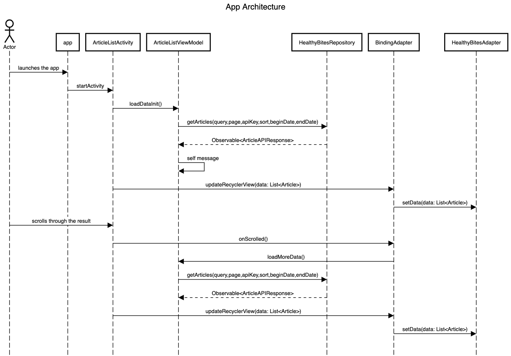
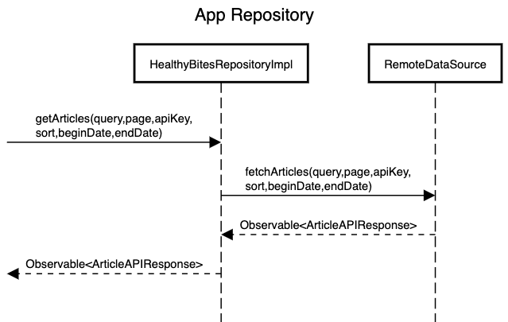
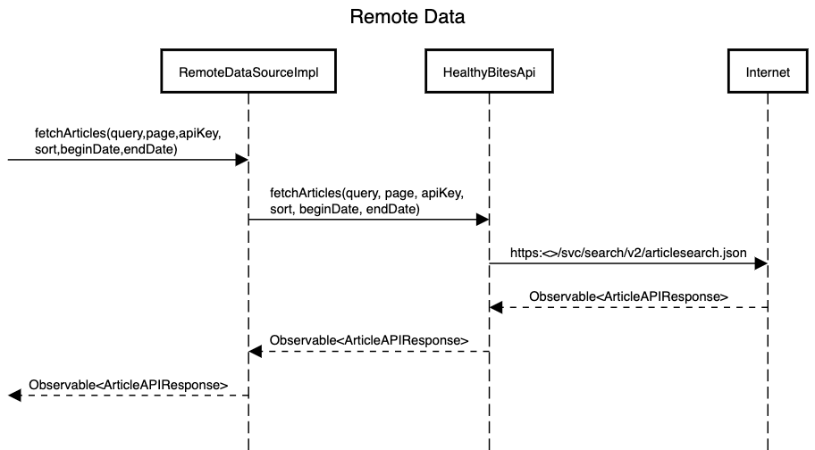
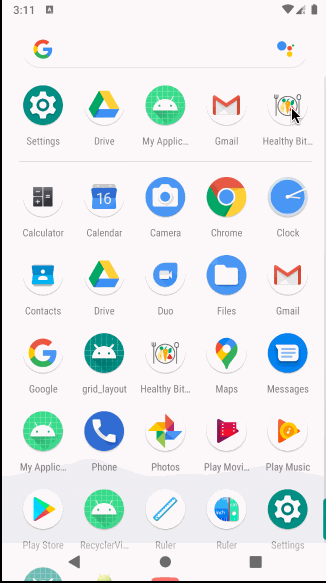

# Healthy Bites
This is a native Android app that uses the The New York Times API and display list of food recipes and healthy diets. This application uses Clean Architecture based on MVVM and Repository patterns. The application is written entirely in Kotlin. Dagger 2 is used for dependency injection.

## How to run the app
Please use Android studio 4.0 to open and run the project in an emulator or in actual device.

## Languages, libraries and tools used

* [Kotlin](https://kotlinlang.org/)
* [Android Architecture Components](https://developer.android.com/topic/libraries/architecture/index.html)
* Android Support Libraries
* [RxJava2](https://github.com/ReactiveX/RxJava/wiki/What's-different-in-2.0)
* [Dagger 2](https://github.com/google/dagger)
* [Retrofit](http://square.github.io/retrofit/)
* [OkHttp](http://square.github.io/okhttp/)
* [Gson](https://github.com/google/gson)
* [Mockito](http://site.mockito.org/)

## Modules
This is a multi module project.
* **app**: this is the main app and entry point. app module has the AppComponent from where other modules can get any external dependencies through Dagger.
* **basekit**: this module contains contract for all the utilities like SchedulerProvider, ImageDownloader, DateParser, ToastMaker that entire app can use.
* **basekitimpl**: implementation of the basekit module contracts.
* **landingscreen**: this module has the actual landing screen (ArticleListActivity) that user will see after app launch. This module has viewmodel which will use the repository contract to get the data from internet.
* **models**: this module has the data models for the entire app.
* **remotedata**: this module contains both the abstraction and implementation of the data source to get data from internet using Retrofit.
* **repositorykit**: Repository contract for the app.
* **repositorykitimpl**: implementation of the repositorykit. Instance of this will be available through the AppComponent. Repository will use the data source contract inside remotedata module to fetch the data.

With this architecture we can easily maintain the app as we have separated module contract and implementation in separate modules. Any module if it has dependency on another module will be dependent on the contract and not the actual implementation. Example - landingscreen module depend on the repositorykit and not the actual implementation, so we can easily swap the implementation without any code change on the dependent modules. Also with this approach we will never face circular dependency problem, multiple teams can work together without breaking each other code. Also using gradle cache we can have faster build time.

## Architecture
The architecture of the project follows the principles of Clean Architecture. Here's how this project implements it:
 
 

 
 

 
 

## App Demo

## Improvements:
* More Unit tests.
* Load small size thumbnail images.
* App should have a local database (Room) to cache result and to support offline capabilities.

## Credits:
All the vector images downloaded from https://www.flaticon.com/
